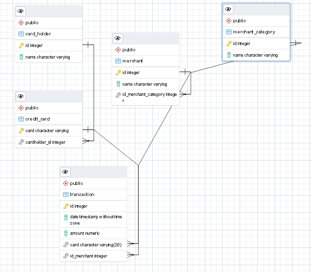
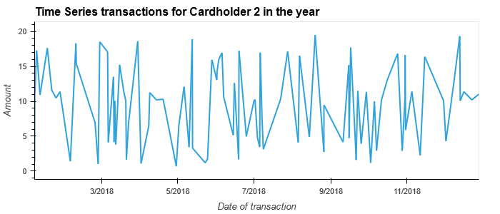
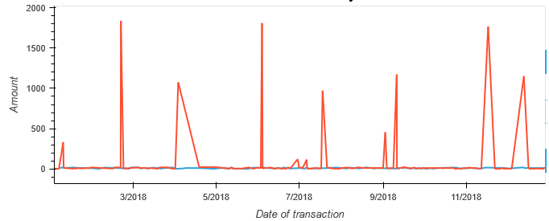
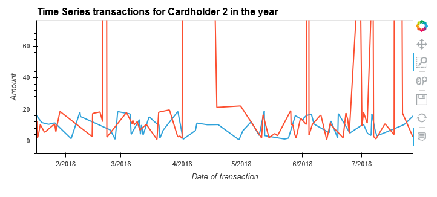

# Module_7_Suspicious_Transactions-
Unit 7 Homework Assignment: Looking for Suspicious Transactions

In this homework assignment, you will apply your new SQL skills to analyze historical credit card transactions and consumption patterns in order to identify possible fraudulent transactions.

# Part 1

## ERD diagram of databases created

Based on the query for under $2 it seems transactions done at restaurants and pubs could be fradulent where as the coffee shop is reasonable to have transactions $2 and lower.

# Part 2

The two most important customers of the firm may have been hacked. Verify if there are any fraudulent transactions in their history. For privacy reasons, you only know that their cardholder IDs are 2 and 18.

Using hvPlot, create a line plot representing the time series of transactions over the course of the year for each cardholder separately.

## Time Series Transactions for Cardholder 2
 

## Time Series Transactions for Cardholder 18

## Time Series Transactions for Cardholder 2 and 18 

## Time Series Transactions for Cardholder 2 and 18 zoomed in

Next, to better compare their patterns, create a single line plot that contains both card holders' trend data.

What difference do you observe between the consumption patterns? Does the difference suggest a fraudulent transaction? Explain your rationale.

*There is quite a big difference in the two cardholder's consumption patterns.  I don't believe cardholder 2 to be fraudulent as the amounts are small and fairly consistent.  However I believe cardholder 18 to be more sporadic, and over a couple months expensive preceeded and followed by small ones to 'test the waters so to speak'*

 Data Analysis Question 2
The CEO of the biggest customer of the firm suspects that someone has used her corporate credit card without authorization in the first quarter of 2018 to pay quite expensive restaurant bills. Again, for privacy reasons, you know only that the cardholder ID in question is 25.

Using Plotly Express, create a box plot, representing the expenditure data from January 2018 to June 2018 for cardholder ID 25.

## Boxplot representing expediture data from January 2018 to June 2018 for Cardholder ID 25

Are there any outliers for cardholder ID 25? How many outliers are there per month?Do you notice any anomalies? 

*Yes a few.  one outlier in January for $1177, one in March for $1334, one in May for $1046, and three in June for $749, $1162, and $1813*

